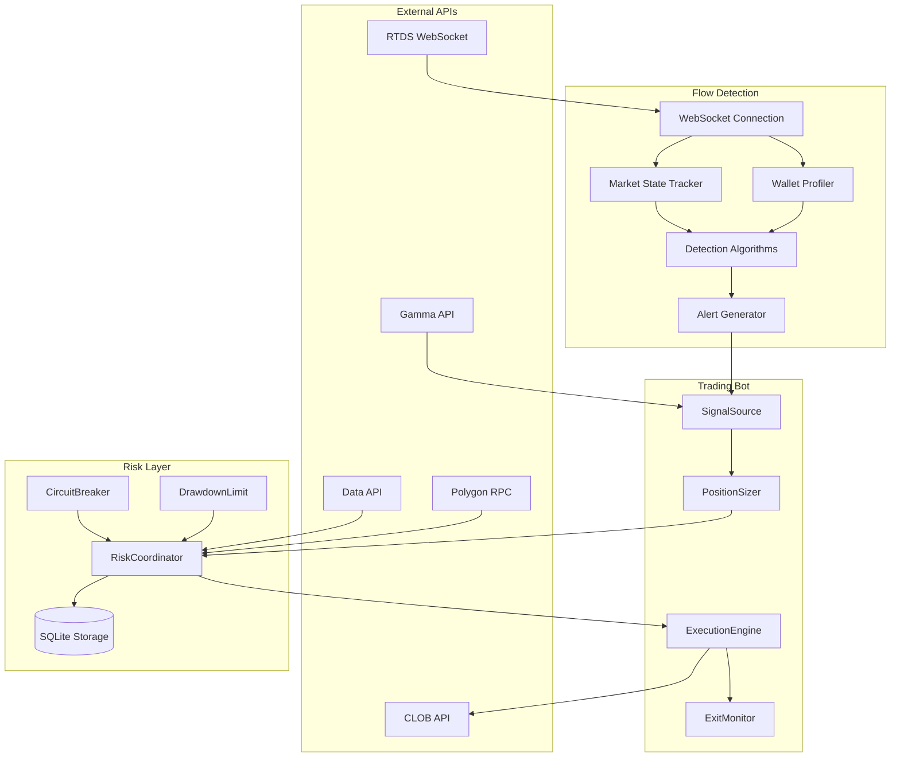
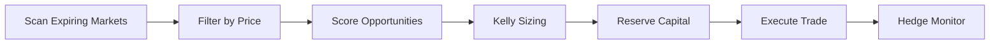
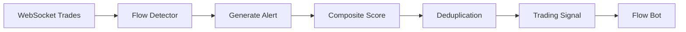
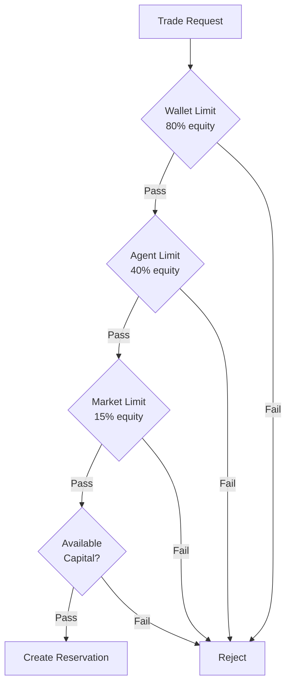
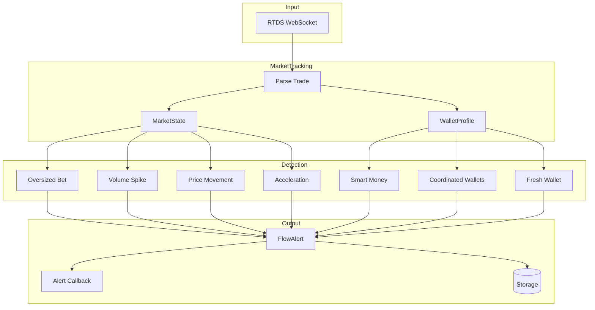

# Polymarket Analytics - Technical Documentation

This document provides a deep-dive into the architecture, APIs, and internals of the Polymarket Analytics trading system. For getting started, see [README.md](README.md).

---

## Table of Contents

1. [Architecture Overview](#architecture-overview)
2. [External APIs](#external-apis)
3. [Trading Agents](#trading-agents)
4. [Component Architecture](#component-architecture)
5. [Risk Coordination](#risk-coordination)
6. [Flow Detection](#flow-detection)
7. [Data Models](#data-models)
8. [Implementing a New Strategy](#implementing-a-new-strategy)

---

## Architecture Overview

The system is built around a composition-based architecture where trading agents are assembled from pluggable components.



### Key Design Principles

1. **Composition over Inheritance**: `TradingBot` accepts pluggable components rather than using subclasses
2. **Atomic Operations**: Capital reservation uses database transactions to prevent race conditions
3. **State Reconciliation**: On startup, DB state is synced with on-chain reality
4. **Fail-Safe Defaults**: Circuit breakers, drawdown limits, and rate limiting are always active

---

## External APIs

### Polymarket APIs

| API | Base URL | Purpose | Rate Limit | Auth Required |
|-----|----------|---------|------------|---------------|
| **RTDS WebSocket** | `wss://ws-live-data.polymarket.com` | Real-time trade stream | N/A | No |
| **Gamma API** | `https://gamma-api.polymarket.com` | Market metadata, resolution status | 4,000/10s | No |
| **CLOB API** | `https://clob.polymarket.com` | Orderbook, price history, order placement | 9,000/10s | Yes (for orders) |
| **Data API** | `https://data-api.polymarket.com` | Positions, activity feed | 1,000/10s | No |

### Gamma API Endpoints

```
GET /markets              # List all markets
GET /markets?closed=true  # Closed/resolved markets
```

Returns market metadata including:
- `conditionId` - Unique market identifier
- `question` - Market question text
- `clobTokenIds` - Token IDs for each outcome
- `outcomePrices` - Current prices per outcome
- `endDate` - Market expiration time
- `resolved` - Resolution status

### CLOB API Endpoints

```
GET /book?token_id=...           # Orderbook snapshot
GET /prices-history?market=...   # Historical prices
GET /trades?asset_id=...         # Recent trades
POST /order                      # Place order (authenticated)
DELETE /order/{id}               # Cancel order (authenticated)
```

### Data API Endpoints

```
GET /positions?user=...   # User's current positions
GET /activity?limit=...   # Global activity feed
GET /activity?user=...    # User-specific activity
```

### RTDS WebSocket

Real-time trade stream via WebSocket subscription:

```json
{
  "action": "subscribe",
  "subscriptions": [
    {"topic": "activity", "type": "trades"}
  ]
}
```

Trade events include:
- `asset` - Token ID
- `price` - Execution price
- `size` - Trade size
- `proxyWallet` - Trader's wallet address
- `outcome` - Outcome name (Yes/No)
- `eventSlug` - Market slug

### Polygon RPC

Used for on-chain balance queries:

```python
# USDC balance query
contract.functions.balanceOf(wallet_address).call()
```

USDC Contract: `0x2791Bca1f2de4661ED88A30C99A7a9449Aa84174` (6 decimals)

---

## Trading Agents

### Bond Strategy

**File**: `polymarket/strategies/bond_strategy.py`

Trades markets near expiration where prices are 95-98¢, betting they resolve to $1.

**Signal Generation**:
- Scans markets expiring in 60s - 30min
- Filters for prices in target range (default 95-98¢)
- Scores by time remaining and expected return

**Position Sizing**: Half-Kelly criterion with 25% max position

**Risk Features**:
- Hedge monitoring for adverse price movements
- Orphan position handler for crashed trades
- Time-bucketed diversification



### Flow Strategy

**File**: `polymarket/strategies/flow_strategy.py`

Copy-trades unusual flow signals from the Flow Detector.

**Signal Generation**:
- Receives alerts from `TradeFeedFlowDetector`
- Computes composite score from multiple alert types
- Applies decay function for signal freshness

**Position Sizing**: Signal-scaled (higher score = larger position)

**Exit Strategy**:
- Take-profit: 5% (optimized via Bayesian search)
- Trailing stop: 2% activation, 1% trail distance
- Stop-loss: 25%
- Max hold: 75 minutes



---

## Component Architecture

The `TradingBot` class uses composition with pluggable components:

```python
bot = TradingBot(
    agent_id="my-bot",
    agent_type="custom",
    signal_source=MySignalSource(),      # Where signals come from
    position_sizer=MyPositionSizer(),    # How to size positions
    executor=MyExecutor(),               # How to execute trades
    exit_config=ExitConfig(...),         # Exit strategy parameters
)
```

### SignalSource

**Base Class**: `polymarket/trading/components/signals.py`

```python
class SignalSource(ABC):
    name: str = "base"
    
    @abstractmethod
    async def get_signals(self) -> List[Signal]:
        """Generate trading signals"""
        pass
```

**Built-in Implementations**:
- `ExpiringMarketSignals` - Markets near expiration
- `FlowAlertSignals` - Flow detector alerts

### PositionSizer

**Base Class**: `polymarket/trading/components/sizers.py`

```python
class PositionSizer(ABC):
    name: str = "base"
    
    @abstractmethod
    def calculate_size(
        self,
        signal: Signal,
        available_capital: float,
        current_price: float
    ) -> float:
        """Calculate position size in USD"""
        pass
```

**Built-in Implementations**:
- `FixedFractionSizer` - Fixed % of capital
- `KellyPositionSizer` - Kelly criterion with edge estimation
- `SignalScaledSizer` - Size based on signal score

### ExecutionEngine

**Base Class**: `polymarket/trading/components/executors.py`

```python
class ExecutionEngine(ABC):
    name: str = "base"
    
    @abstractmethod
    async def execute(
        self,
        client: ClobClient,
        token_id: str,
        side: Side,
        size_usd: float,
        price: float,
        orderbook: Optional[OrderbookSnapshot],
        original_signal_price: Optional[float] = None,
    ) -> ExecutionResult:
        """Execute a trade"""
        pass
```

**Built-in Implementations**:
- `DryRunExecutor` - Simulates execution (no real trades)
- `AggressiveExecutor` - IOC orders with slippage protection

### ExitMonitor

**File**: `polymarket/trading/components/exit_strategies.py`

Monitors positions for exit conditions:

```python
@dataclass
class ExitConfig:
    take_profit_pct: float = 0.10       # Exit at +10%
    stop_loss_pct: float = 0.15         # Exit at -15%
    trailing_stop_enabled: bool = True
    trailing_stop_activation_pct: float = 0.05
    trailing_stop_distance_pct: float = 0.02
    max_hold_minutes: int = 120         # Force exit after 2 hours
```

---

## Risk Coordination

**File**: `polymarket/trading/risk_coordinator.py`

The `RiskCoordinator` ensures safe multi-agent operation:

### Atomic Capital Reservation

```python
# Request capital (atomic - no race conditions)
reservation_id = coordinator.atomic_reserve(
    agent_id="bond-1",
    market_id="0x...",
    token_id="0x...",
    amount_usd=100.0
)

if reservation_id:
    try:
        result = await execute_trade(...)
        coordinator.confirm_execution(
            reservation_id,
            filled_shares=result.shares,
            filled_price=result.price
        )
    except:
        coordinator.release_reservation(reservation_id)
```

### Exposure Limits



### State Reconciliation

On startup, the coordinator:
1. Fetches actual positions from Polymarket API
2. Fetches USDC balance from Polygon
3. Identifies orphan positions (on-chain but not in DB)
4. Identifies ghost positions (in DB but not on-chain)
5. Releases stale reservations
6. Marks crashed agents

### Safety Components

**CircuitBreaker**: Stops trading after N consecutive failures
```python
circuit_breaker = CircuitBreaker(
    failure_threshold=5,
    reset_timeout_seconds=300
)
```

**DrawdownLimit**: Stops trading on excessive losses
```python
drawdown_limit = DrawdownLimit(
    max_daily_drawdown_pct=0.10,
    max_total_drawdown_pct=0.25
)
```

---

## Flow Detection

**File**: `polymarket/flow_detector.py`

### Architecture



### Detection Algorithms

| Algorithm | Trigger Condition | Severity |
|-----------|-------------------|----------|
| **Oversized Bet** | Trade 10x+ median or >$10k | HIGH/CRITICAL |
| **Smart Money** | Wallet with >10 trades, >$50k volume | HIGH |
| **Coordinated Wallets** | 2+ on-chain connected wallets in 60s | MEDIUM-CRITICAL |
| **Volume Spike** | 1-min volume 3x+ baseline | MEDIUM-HIGH |
| **Price Movement** | Z-score > 2.5 from normal | MEDIUM-CRITICAL |
| **Acceleration** | Recent change 2x earlier change | MEDIUM-HIGH |
| **Fresh Wallet** | <7 days on-chain + significant trade | MEDIUM-CRITICAL |

### Volatility-Adjusted Thresholds

Price movement detection uses per-market volatility:

```python
# Z-score based detection
z_score = (current_change - mean_return) / std_return
is_unusual = abs(z_score) >= 2.5  # Top ~1% of moves
```

### On-Chain Wallet Analysis

The detector checks Polygon for:
- Wallet creation date (first transaction)
- Total transaction count
- USDC transfer history (funding sources)

```python
# Detect freshly created wallets
if wallet_age_days <= 7:
    severity = "CRITICAL" if trade_value >= 25000 else "HIGH"
```

---

## Data Models

**File**: `polymarket/core/models.py`

### Core Types

```python
class Side(Enum):
    BUY = "BUY"
    SELL = "SELL"

class SignalDirection(Enum):
    BUY = "BUY"
    SELL = "SELL"
    NEUTRAL = "NEUTRAL"

class PositionStatus(Enum):
    OPEN = "open"
    CLOSED = "closed"
    ORPHAN = "orphan"  # On-chain but not tracked
```

### Market

```python
@dataclass
class Market:
    condition_id: str        # Unique identifier
    question: str            # Market question
    slug: str               # URL slug
    end_date: datetime      # Expiration time
    tokens: List[Token]     # Outcome tokens
    start_date: Optional[datetime]
    category: Optional[str]
    closed: bool
    resolved: bool
    winning_outcome: Optional[str]
    
    @property
    def seconds_left(self) -> float: ...
    
    @property
    def is_expired(self) -> bool: ...
```

### Signal

```python
@dataclass
class Signal:
    market_id: str
    token_id: str
    direction: SignalDirection
    score: float              # 0-100 composite score
    timestamp: datetime
    source: str               # e.g., "flow_alerts"
    metadata: Dict[str, Any]  # Additional context
    
    @property
    def is_buy(self) -> bool: ...
```

### Position

```python
@dataclass
class Position:
    id: Optional[int]         # Database ID
    agent_id: str
    market_id: str
    token_id: str
    outcome: str
    shares: float
    entry_price: float
    entry_time: Optional[datetime]
    current_price: Optional[float]
    status: PositionStatus
    
    @property
    def cost_basis(self) -> float: ...
    
    @property
    def unrealized_pnl(self) -> float: ...
```

### ExecutionResult

```python
@dataclass
class ExecutionResult:
    success: bool
    order_id: Optional[str]
    filled_shares: float
    filled_price: float
    requested_shares: float
    requested_price: float
    error_message: Optional[str]
    
    @property
    def slippage(self) -> float: ...
```

---

## Implementing a New Strategy

This guide walks through creating a new trading strategy from scratch.

### Step 1: Create a Signal Source

Create a new file or add to `polymarket/trading/components/signals.py`:

```python
from typing import List, Optional
from datetime import datetime, timezone
from ..core.models import Signal, SignalDirection
from .signals import SignalSource

class MyCustomSignals(SignalSource):
    """
    Custom signal source for my strategy.
    
    This example generates signals based on price momentum.
    """
    name = "my_custom"
    
    def __init__(
        self,
        lookback_minutes: int = 15,
        min_change_pct: float = 0.05,
    ):
        self.lookback_minutes = lookback_minutes
        self.min_change_pct = min_change_pct
        self._markets: List[Market] = []
    
    def update_markets(self, markets: List[Market]):
        """Update available markets (called periodically)"""
        self._markets = markets
    
    async def get_signals(self) -> List[Signal]:
        """Generate trading signals"""
        signals = []
        
        for market in self._markets:
            # Skip expired/closed markets
            if market.is_expired or market.closed:
                continue
            
            for token in market.tokens:
                # Your signal logic here
                # Example: detect momentum
                price_change = self._calculate_momentum(token.token_id)
                
                if price_change is None:
                    continue
                
                # Generate BUY signal on positive momentum
                if price_change >= self.min_change_pct:
                    signals.append(Signal(
                        market_id=market.condition_id,
                        token_id=token.token_id,
                        direction=SignalDirection.BUY,
                        score=min(100, price_change * 1000),  # Scale to 0-100
                        source=self.name,
                        metadata={
                            "question": market.question,
                            "price": token.price,
                            "momentum": price_change,
                        }
                    ))
                
                # Generate SELL signal on negative momentum
                elif price_change <= -self.min_change_pct:
                    signals.append(Signal(
                        market_id=market.condition_id,
                        token_id=token.token_id,
                        direction=SignalDirection.SELL,
                        score=min(100, abs(price_change) * 1000),
                        source=self.name,
                        metadata={
                            "question": market.question,
                            "price": token.price,
                            "momentum": price_change,
                        }
                    ))
        
        return signals
    
    def _calculate_momentum(self, token_id: str) -> Optional[float]:
        """Calculate price momentum for a token"""
        # Implement your momentum calculation
        # Could use price history from API, internal state, etc.
        return None  # Placeholder
```

### Step 2: Choose or Create a Position Sizer

Use an existing sizer or create a custom one:

```python
from .sizers import PositionSizer

class MomentumScaledSizer(PositionSizer):
    """Scale position size based on momentum strength"""
    name = "momentum_scaled"
    
    def __init__(
        self,
        base_pct: float = 0.05,      # 5% base position
        max_pct: float = 0.15,       # 15% max position
        momentum_scale: float = 2.0,  # 2x at max momentum
    ):
        self.base_pct = base_pct
        self.max_pct = max_pct
        self.momentum_scale = momentum_scale
    
    def calculate_size(
        self,
        signal: Signal,
        available_capital: float,
        current_price: float
    ) -> float:
        # Base position
        base_size = available_capital * self.base_pct
        
        # Scale by momentum (from signal metadata)
        momentum = abs(signal.metadata.get("momentum", 0))
        scale = 1.0 + (momentum * self.momentum_scale)
        
        # Apply scaling with cap
        scaled_size = base_size * scale
        max_size = available_capital * self.max_pct
        
        return min(scaled_size, max_size)
```

### Step 3: Configure Exit Strategy

Define when to exit positions:

```python
from ..trading.components.exit_strategies import ExitConfig

exit_config = ExitConfig(
    # Take profit at 10% gain
    take_profit_pct=0.10,
    
    # Stop loss at 8% loss
    stop_loss_pct=0.08,
    
    # Trailing stop: activate at 5% profit, trail by 2%
    trailing_stop_enabled=True,
    trailing_stop_activation_pct=0.05,
    trailing_stop_distance_pct=0.02,
    
    # Force exit after 2 hours regardless of P&L
    max_hold_minutes=120,
)
```

### Step 4: Create Strategy Factory Function

Create `polymarket/strategies/my_strategy.py`:

```python
"""
My Custom Strategy - Momentum-based trading.

This strategy buys tokens showing positive momentum and sells
those showing negative momentum.
"""

import asyncio
import logging
from typing import Optional

from ..core.config import Config, get_config
from ..core.api import PolymarketAPI
from ..trading.bot import TradingBot
from ..trading.components.signals import MyCustomSignals
from ..trading.components.sizers import MomentumScaledSizer
from ..trading.components.executors import AggressiveExecutor, DryRunExecutor
from ..trading.components.exit_strategies import ExitConfig

logger = logging.getLogger(__name__)


def create_my_bot(
    agent_id: str = "momentum-bot",
    config: Optional[Config] = None,
    dry_run: bool = False,
    lookback_minutes: int = 15,
    min_momentum: float = 0.05,
    exit_config: Optional[ExitConfig] = None,
) -> TradingBot:
    """
    Create a momentum strategy trading bot.
    
    Args:
        agent_id: Unique identifier for this agent
        config: Configuration (uses default if not provided)
        dry_run: If True, simulate trades without execution
        lookback_minutes: Minutes to look back for momentum
        min_momentum: Minimum price change to generate signal
        exit_config: Exit strategy configuration
    
    Returns:
        Configured TradingBot ready to start
    """
    config = config or get_config()
    
    # Log configuration
    logger.info(f"{'='*60}")
    logger.info(f"📈 MOMENTUM STRATEGY CONFIGURATION")
    logger.info(f"{'='*60}")
    logger.info(f"  Agent ID:       {agent_id}")
    logger.info(f"  Mode:           {'DRY RUN' if dry_run else 'LIVE'}")
    logger.info(f"  Lookback:       {lookback_minutes} minutes")
    logger.info(f"  Min Momentum:   {min_momentum:.1%}")
    logger.info(f"{'='*60}")
    
    # Default exit config
    exit_cfg = exit_config or ExitConfig(
        take_profit_pct=0.10,
        stop_loss_pct=0.08,
        trailing_stop_enabled=True,
        trailing_stop_activation_pct=0.05,
        trailing_stop_distance_pct=0.02,
        max_hold_minutes=120,
    )
    
    # Create components
    signal_source = MyCustomSignals(
        lookback_minutes=lookback_minutes,
        min_change_pct=min_momentum,
    )
    
    position_sizer = MomentumScaledSizer(
        base_pct=0.05,
        max_pct=0.15,
    )
    
    executor = DryRunExecutor() if dry_run else AggressiveExecutor(
        max_slippage=0.02
    )
    
    # Create and return bot
    return TradingBot(
        agent_id=agent_id,
        agent_type="momentum",
        signal_source=signal_source,
        position_sizer=position_sizer,
        executor=executor,
        config=config,
        dry_run=dry_run,
        exit_config=exit_cfg,
    )


async def run_my_bot(
    agent_id: str = "momentum-bot",
    dry_run: bool = False,
    interval: float = 10.0,
):
    """Run the momentum strategy bot"""
    bot = create_my_bot(agent_id=agent_id, dry_run=dry_run)
    
    try:
        await bot.start()
        await bot.run(interval_seconds=interval)
    except KeyboardInterrupt:
        logger.info("Interrupted by user")
    finally:
        await bot.stop()


if __name__ == "__main__":
    import argparse
    
    parser = argparse.ArgumentParser(description="Momentum Strategy Bot")
    parser.add_argument("--agent-id", default="momentum-bot")
    parser.add_argument("--dry-run", action="store_true")
    parser.add_argument("--interval", type=float, default=10.0)
    
    args = parser.parse_args()
    
    logging.basicConfig(
        level=logging.INFO,
        format='%(asctime)s | %(levelname)s | %(message)s'
    )
    
    asyncio.run(run_my_bot(
        agent_id=args.agent_id,
        dry_run=args.dry_run,
        interval=args.interval,
    ))
```

### Step 5: Add CLI Entry Point

Update `run_bot.py` to support your new strategy:

```python
# In run_bot.py, add to the strategy selection:

if args.strategy == "momentum":
    from polymarket.strategies.my_strategy import create_my_bot
    bot = create_my_bot(
        agent_id=args.agent_id,
        dry_run=args.dry_run,
    )
```

### Step 6: Testing Checklist

Before running live:

- [ ] **Dry run mode works**: `python run_bot.py momentum --dry-run`
- [ ] **Signals generate correctly**: Check logs for signal output
- [ ] **Position sizing is reasonable**: Verify sizes don't exceed limits
- [ ] **Exit strategies trigger**: Test take-profit and stop-loss
- [ ] **Risk limits respected**: Agent/wallet/market exposure limits work
- [ ] **Error handling**: Bot recovers from API errors gracefully
- [ ] **Backtesting** (optional): Run historical simulation

### Step 7: Add Backtest Support (Optional)

Create `polymarket/backtesting/strategies/my_backtest.py`:

```python
from ..base import BaseBacktester
from ...strategies.my_strategy import MyCustomSignals

class MomentumBacktester(BaseBacktester):
    """Backtest the momentum strategy"""
    
    async def run(self, ...):
        # Implement backtesting logic
        pass
```

---

## Further Reading

- [Polymarket CLOB Documentation](https://docs.polymarket.com/)
- [py-clob-client GitHub](https://github.com/Polymarket/py-clob-client)
- [Polygon RPC Providers](https://wiki.polygon.technology/docs/tools/network)

