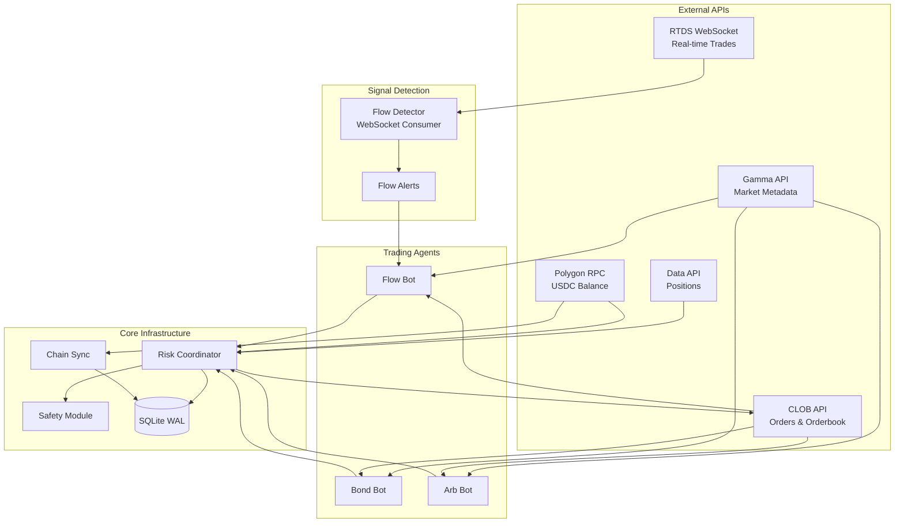
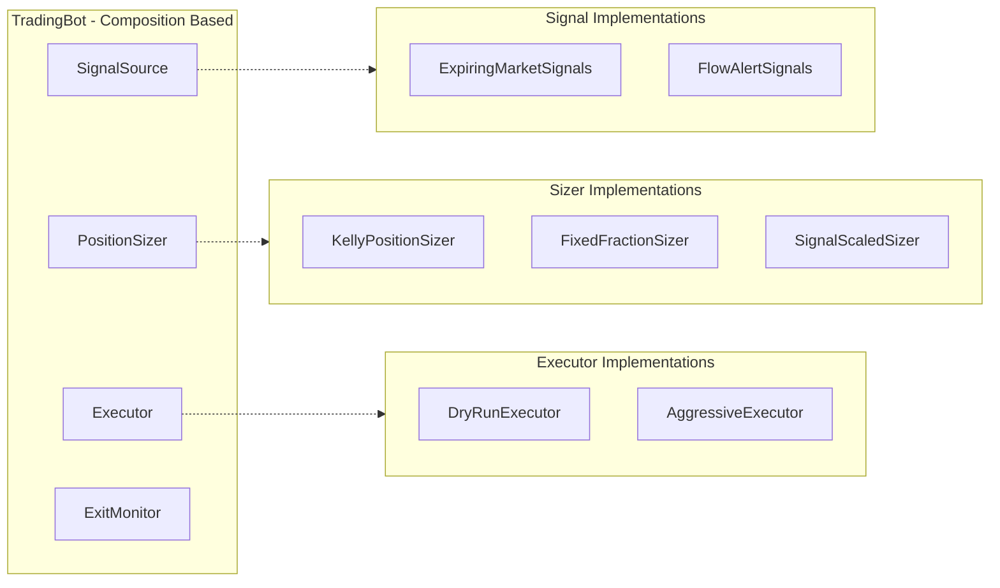
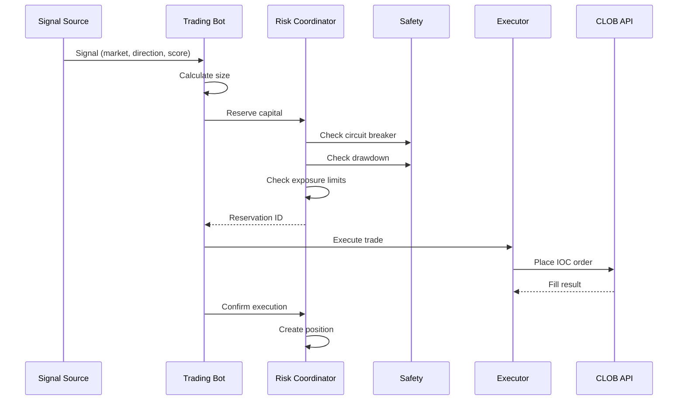
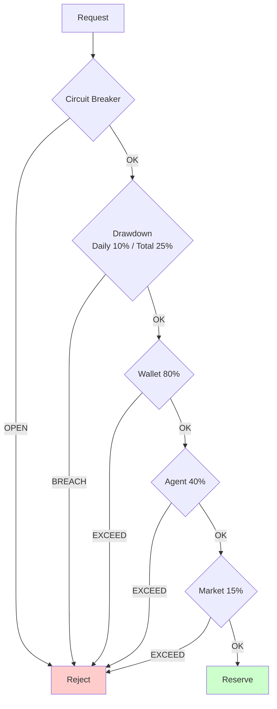
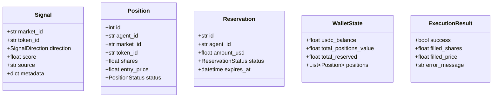
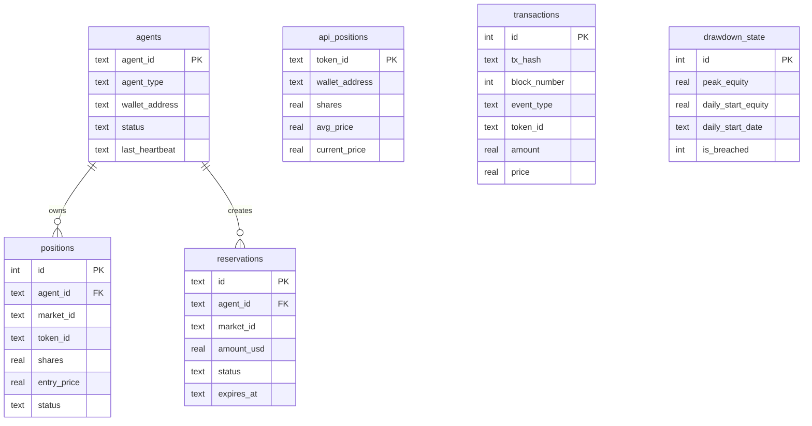

# CLAUDE.md

Guidance for Claude Code when working with this repository.

## Project Overview

Polymarket Analytics: Multi-agent trading infrastructure for Polymarket prediction markets.

- **Language**: Python 3.10+ (async-first)
- **Strategies**: Bond (expiring markets), Flow (copy trading), Arbitrage (delta-neutral)
- **Features**: Atomic capital reservation, real-time flow detection, on-chain sync

---

## Architecture



### Component Architecture



### Trading Flow



### Risk Check Flow



---

## Common Commands

```bash
# Trading bots
python scripts/run_bot.py bond --dry-run --agent-id bond-1
python scripts/run_bot.py flow --dry-run --agent-id flow-1
python scripts/run_arb_bot.py --dry-run

# Live trading
python scripts/run_bot.py bond --agent-id bond-1 --interval 60
python scripts/run_bot.py flow --agent-id flow-1 --interval 5
python scripts/run_arb_bot.py --min-edge 0.02 --position-size 50

# Risk monitoring
python scripts/risk_monitor.py status
python scripts/risk_monitor.py agents
python scripts/risk_monitor.py positions
python scripts/risk_monitor.py drawdown
python scripts/risk_monitor.py sync
python scripts/risk_monitor.py reset-drawdown

# Backtesting
python -m polymarket.backtesting.strategies.bond_backtest --backtest
python -m polymarket.backtesting.strategies.flow_backtest --backtest
python -m polymarket.backtesting.strategies.arb_backtest --backtest

# Optimization (Bayesian, anti-overfitting)
python -m polymarket.backtesting.strategies.bond_backtest --optimize -n 50
python -m polymarket.backtesting.strategies.flow_backtest --optimize -n 50

# Web dashboard
python scripts/run_webapp.py

# Tests
pytest tests/
pytest tests/test_risk_engine_integration.py -v
```

---

## API Reference

### External APIs

| API | Base URL | Purpose | Rate Limit |
|-----|----------|---------|------------|
| **RTDS WebSocket** | `wss://ws-live-data.polymarket.com` | Real-time trades | N/A |
| **Gamma API** | `https://gamma-api.polymarket.com` | Markets, resolution | 4,000/10s |
| **CLOB API** | `https://clob.polymarket.com` | Orderbook, orders | 9,000/10s |
| **Data API** | `https://data-api.polymarket.com` | Positions, history | 1,000/10s |
| **Polygon RPC** | Configurable | USDC, on-chain | Varies |

### Key Endpoints

```
# CLOB API
GET  /book?token_id={id}           # Orderbook
GET  /price?token_id={id}          # Mid price
POST /order                         # Place order
DELETE /order/{id}                  # Cancel
GET  /orders?market={id}           # List orders

# Gamma API
GET  /markets                       # All markets
GET  /markets/{id}                  # Market details
GET  /markets?closed=false          # Active only

# Data API
GET  /positions?user={addr}         # Positions
GET  /activity?user={addr}          # Trade history
```

### Internal Python APIs

```python
# RiskCoordinator
coordinator.atomic_reserve(agent_id, market_id, token_id, amount_usd) -> str
coordinator.confirm_execution(reservation_id, filled_shares, filled_price) -> bool
coordinator.release_reservation(reservation_id) -> bool
coordinator.get_wallet_state() -> WalletState
coordinator.reconcile_positions() -> Tuple[int, int]

# TradingBot
bot = TradingBot(
    agent_id="bond-1",
    signal_source=ExpiringMarketSignals(...),
    position_sizer=KellyPositionSizer(...),
    executor=AggressiveExecutor(...),
    exit_config=ExitConfig(...)
)
await bot.start()
await bot.stop()

# FlowDetector
detector = FlowDetector(
    on_alert=callback,
    min_trade_size=100
)
await detector.start()

# Storage
with storage.transaction() as txn:
    txn.create_position(...)
    txn.get_wallet_state(wallet_address)
    txn.update_drawdown_state(...)
```

---

## Data Models



### Enums

```python
class Side(Enum):
    BUY = "BUY"
    SELL = "SELL"

class SignalDirection(Enum):
    BUY = "BUY"
    SELL = "SELL"

class PositionStatus(Enum):
    OPEN = "open"
    CLOSED = "closed"
    EXPIRED = "expired"

class ReservationStatus(Enum):
    PENDING = "pending"
    EXECUTED = "executed"
    RELEASED = "released"
    EXPIRED = "expired"

class AgentStatus(Enum):
    ACTIVE = "active"
    STOPPED = "stopped"
    CRASHED = "crashed"
```

---

## Project Structure

```
polymarket/
├── core/                      # Shared infrastructure
│   ├── api.py                 # Async Polymarket API client
│   ├── config.py              # Configuration with validation
│   ├── models.py              # All dataclasses (centralized)
│   └── rate_limiter.py        # Sliding window rate limiter
│
├── trading/                   # Live trading
│   ├── bot.py                 # TradingBot (composition-based)
│   ├── risk_coordinator.py    # Multi-agent risk management
│   ├── chain_sync.py          # On-chain transaction sync
│   ├── safety.py              # Circuit breaker, drawdown
│   ├── storage/
│   │   ├── base.py            # Abstract storage interface
│   │   └── sqlite.py          # SQLite implementation (WAL)
│   └── components/
│       ├── signals.py         # Signal sources
│       ├── sizers.py          # Position sizers
│       ├── executors.py       # Execution engines
│       ├── exit_strategies.py # Exit monitors
│       ├── hedge_monitor.py   # Hedge monitoring
│       └── hedge_strategies.py # Hedge execution
│
├── strategies/                # Strategy implementations
│   ├── bond_strategy.py       # Expiring markets (95-98c -> $1)
│   ├── flow_strategy.py       # Flow copy (smart money signals)
│   └── arb_strategy.py        # Delta-neutral arbitrage
│
├── flow_detector.py           # Real-time WebSocket flow detection
│
└── backtesting/               # Backtesting framework
    ├── base.py                # BaseBacktester class
    ├── results.py             # BacktestResults dataclass
    ├── execution.py           # Simulated execution
    ├── optimization.py        # Bayesian optimizer (anti-overfitting)
    ├── liquidity_provider.py  # Historical orderbook provider
    ├── strategies/
    │   ├── bond_backtest.py   # Bond (3 params)
    │   ├── flow_backtest.py   # Flow (3 params)
    │   └── arb_backtest.py    # Arb (3 params)
    └── data/
        ├── cache.py           # SQLite price/trade cache
        ├── cached_fetcher.py  # Cached data fetcher
        └── trade_fetcher.py   # Historical trade fetcher
```

### Key Files

| Purpose | File |
|---------|------|
| Bot entry | `scripts/run_bot.py` |
| Arb bot | `scripts/run_arb_bot.py` |
| Risk monitor | `scripts/risk_monitor.py` |
| Bond strategy | `polymarket/strategies/bond_strategy.py` |
| Flow strategy | `polymarket/strategies/flow_strategy.py` |
| Arb strategy | `polymarket/strategies/arb_strategy.py` |
| Risk coordinator | `polymarket/trading/risk_coordinator.py` |
| Safety | `polymarket/trading/safety.py` |
| Storage | `polymarket/trading/storage/sqlite.py` |
| Flow detector | `polymarket/flow_detector.py` |

---

## Database Schema



---

## Configuration

```bash
# .env
PRIVATE_KEY=0x...
POLYMARKET_PROXY_ADDRESS=0x...
POLYGON_RPC_URL=https://polygon-rpc.com

# Risk limits
MAX_WALLET_EXPOSURE_PCT=0.80
MAX_PER_AGENT_EXPOSURE_PCT=0.40
MAX_PER_MARKET_EXPOSURE_PCT=0.15
MAX_DAILY_DRAWDOWN_PCT=0.10
MAX_TOTAL_DRAWDOWN_PCT=0.25
CIRCUIT_BREAKER_FAILURES=5
```

---

## Development Guidelines

- **No emojis** in code/comments
- **Full typing** on all functions
- **pytest** for testing (not unittest)
- **Async/await** for all I/O
- **Database transactions** for atomic ops
- **Chain sync** is source of truth for positions

---

## Backtesting

### Anti-Overfitting

- **3 parameters only** per strategy
- **Walk-forward validation** (train past, test future)
- **L2 regularization** toward sensible defaults
- **Bootstrap confidence** for stability

### Parameter Spaces

**Bond (3 params):**
| Param | Range | Default |
|-------|-------|---------|
| entry_price | 0.92-0.97 | 0.95 |
| max_spread_pct | 0.01-0.06 | 0.03 |
| max_position_pct | 0.05-0.20 | 0.10 |

**Flow (3 params):**
| Param | Range | Default |
|-------|-------|---------|
| take_profit_pct | 0.03-0.15 | 0.06 |
| stop_loss_pct | 0.04-0.20 | 0.08 |
| max_position_pct | 0.05-0.20 | 0.10 |

### Results Interpretation

- **CV Score**: Avg Sharpe across walk-forward folds
- **Holdout Score**: Sharpe on unseen future data
- **Overfitting Ratio**: CV/Holdout (ideal ~1.0, >1.5 = overfitting)
- **Verdict**: PASS/WARN/FAIL

---

## Debugging

```bash
# Check logs
tail -f logs/{agent_id}.log
tail -f logs/{agent_id}_trades.log

# Wallet state
python scripts/risk_monitor.py status

# Force sync
python scripts/risk_monitor.py sync

# Reset drawdown
python scripts/risk_monitor.py reset-drawdown

# Inspect DB
sqlite3 data/risk_state.db
> .tables
> SELECT * FROM positions WHERE status = 'open';
> SELECT * FROM drawdown_state;
```
