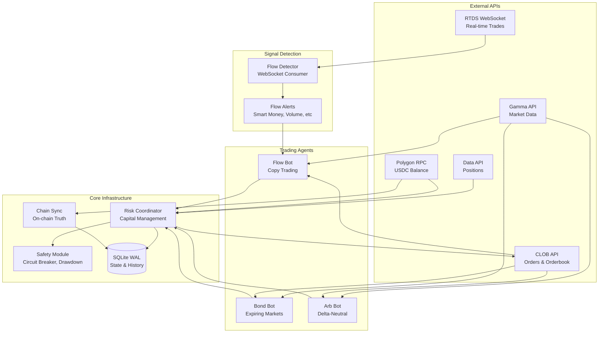
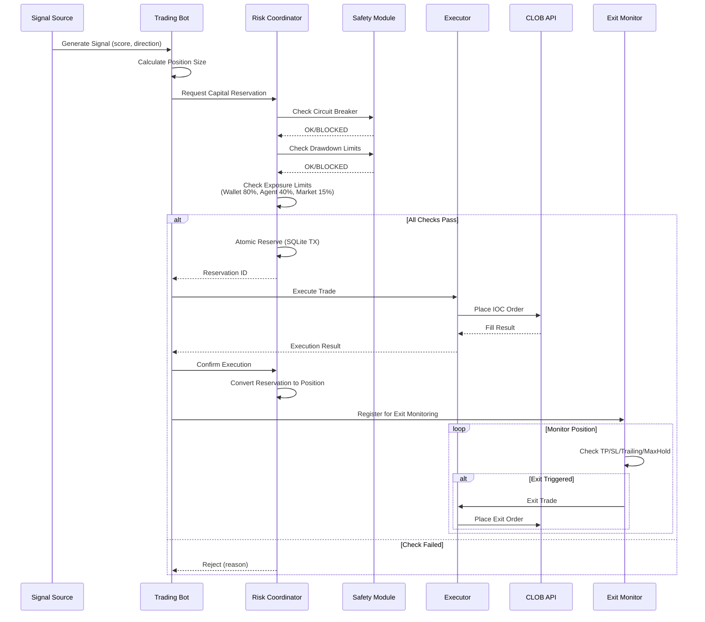
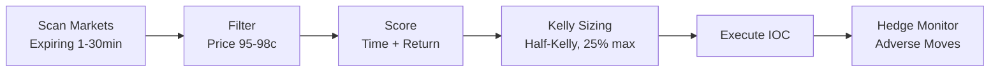
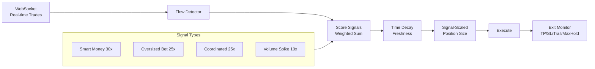
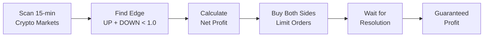
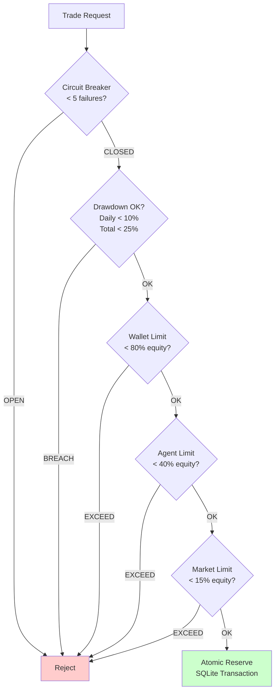
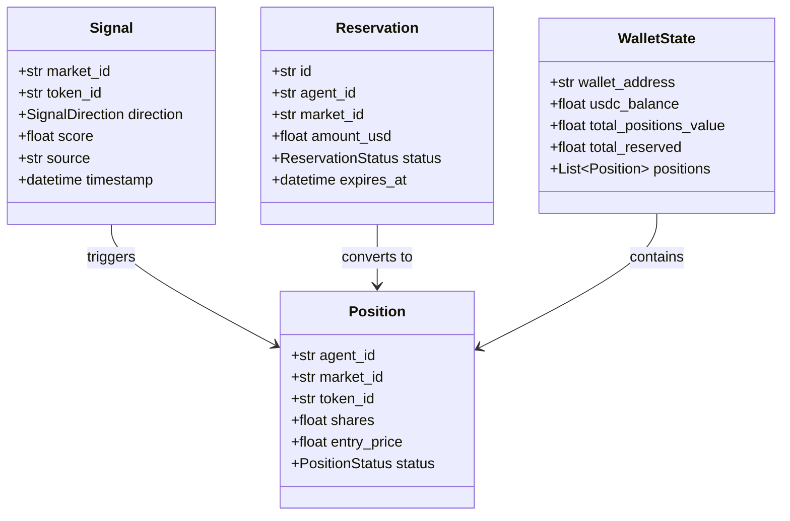

# Polymarket Analytics

Multi-agent trading infrastructure for Polymarket prediction markets.

```
Strategies: Bond (expiring markets) | Flow (copy trading) | Arbitrage (delta-neutral)
Features:   Atomic capital reservation | Real-time flow detection | On-chain sync
```

---

## Architecture Overview



---

## Trading Flow



---

## Quick Start

```bash
# Setup
git clone <repo-url> && cd polymarket-analytics
python3 -m venv venv && source venv/bin/activate
pip install -r requirements.txt
cp .env.example .env  # Add your keys

# Run bots (dry-run first)
python scripts/run_bot.py bond --dry-run
python scripts/run_bot.py flow --dry-run
python scripts/run_arb_bot.py --dry-run

# Monitor
python scripts/risk_monitor.py status
```

---

## Strategies

### Bond Strategy (Expiring Markets)

Buys markets at 95-98c near expiration, expecting resolution to $1.



```bash
python scripts/run_bot.py bond --dry-run --interval 10
python scripts/run_bot.py bond --agent-id bond-1 --min-price 0.94 --max-price 0.99
```

### Flow Strategy (Copy Trading)

Copies unusual flow from smart money, oversized bets, coordinated wallets.



```bash
python scripts/run_bot.py flow --dry-run --min-score 30
python scripts/run_bot.py flow --agent-id flow-1 --category crypto
```

### Arbitrage Strategy (Delta-Neutral)

Risk-free arbitrage on binary markets where both sides sum to < $1.



```bash
python scripts/run_arb_bot.py --dry-run
python scripts/run_arb_bot.py --min-edge 0.02 --position-size 50
```

---

## Risk Management



| Limit | Value | Description |
|-------|-------|-------------|
| Wallet Exposure | 80% | Max total exposure |
| Agent Exposure | 40% | Max per trading agent |
| Market Exposure | 15% | Max per single market |
| Daily Drawdown | 10% | Stop trading for day |
| Total Drawdown | 25% | Stop trading entirely |
| Circuit Breaker | 5 | Consecutive failures |

### Monitoring Commands

```bash
python scripts/risk_monitor.py status         # Wallet & risk overview
python scripts/risk_monitor.py agents         # List agents
python scripts/risk_monitor.py positions      # Open positions
python scripts/risk_monitor.py drawdown       # Drawdown status
python scripts/risk_monitor.py sync           # Force chain sync
python scripts/risk_monitor.py reset-drawdown # Reset DD tracking
python scripts/risk_monitor.py stop-all       # Emergency stop
```

---

## API Reference

### External APIs

| API | Base URL | Purpose | Rate Limit |
|-----|----------|---------|------------|
| **RTDS WebSocket** | `wss://ws-live-data.polymarket.com` | Real-time trades stream | N/A |
| **Gamma API** | `https://gamma-api.polymarket.com` | Market metadata, resolution | 4,000/10s |
| **CLOB API** | `https://clob.polymarket.com` | Orderbook, place/cancel orders | 9,000/10s |
| **Data API** | `https://data-api.polymarket.com` | Positions, trade history | 1,000/10s |
| **Polygon RPC** | Configurable | USDC balance, on-chain data | Varies |

### Key Endpoints

```
# CLOB API
GET  /book?token_id={id}           # Orderbook snapshot
GET  /price?token_id={id}          # Current mid price
POST /order                         # Place order
DELETE /order/{id}                  # Cancel order
GET  /orders?market={id}           # List orders

# Gamma API
GET  /markets                       # All markets
GET  /markets/{id}                  # Market details
GET  /markets?closed=false          # Active markets

# Data API
GET  /positions?user={addr}         # User positions
GET  /activity?user={addr}          # Trade history
```

### Internal APIs (Python)

```python
# Risk Coordinator
coordinator.atomic_reserve(agent_id, market_id, token_id, amount_usd)
coordinator.confirm_execution(reservation_id, filled_shares, filled_price)
coordinator.release_reservation(reservation_id)
coordinator.get_wallet_state() -> WalletState

# Trading Bot
bot = TradingBot(signal_source, position_sizer, executor, exit_config)
await bot.start()
await bot.stop()

# Flow Detector
detector = FlowDetector(on_alert_callback)
await detector.start()
```

---

## Data Models



---

## Project Structure

```
polymarket-analytics/
├── polymarket/
│   ├── core/                      # Shared infrastructure
│   │   ├── api.py                 # Async Polymarket API client
│   │   ├── config.py              # Configuration management
│   │   ├── models.py              # All dataclasses
│   │   └── rate_limiter.py        # Sliding window limiter
│   │
│   ├── trading/                   # Live trading
│   │   ├── bot.py                 # TradingBot (composition-based)
│   │   ├── risk_coordinator.py    # Multi-agent risk management
│   │   ├── chain_sync.py          # On-chain transaction sync
│   │   ├── safety.py              # Circuit breaker, drawdown
│   │   ├── storage/sqlite.py      # SQLite persistence (WAL)
│   │   └── components/            # Pluggable components
│   │       ├── signals.py         # Signal sources
│   │       ├── sizers.py          # Position sizers
│   │       ├── executors.py       # Execution engines
│   │       └── exit_strategies.py # Exit monitors
│   │
│   ├── strategies/                # Strategy implementations
│   │   ├── bond_strategy.py       # Expiring markets
│   │   ├── flow_strategy.py       # Flow copy trading
│   │   └── arb_strategy.py        # Delta-neutral arb
│   │
│   ├── flow_detector.py           # Real-time flow detection
│   │
│   └── backtesting/               # Backtesting framework
│       ├── base.py                # BaseBacktester
│       ├── optimization.py        # Bayesian optimizer
│       └── strategies/            # Strategy backtests
│
├── scripts/                       # CLI tools
│   ├── run_bot.py                 # Main bot entry
│   ├── run_arb_bot.py             # Arbitrage bot
│   └── risk_monitor.py            # Monitoring CLI
│
└── data/                          # SQLite databases
```

---

## Backtesting

```bash
# Run backtests
python -m polymarket.backtesting.strategies.bond_backtest --backtest
python -m polymarket.backtesting.strategies.flow_backtest --backtest
python -m polymarket.backtesting.strategies.arb_backtest --backtest

# Parameter optimization (Bayesian, anti-overfitting)
python -m polymarket.backtesting.strategies.bond_backtest --optimize -n 50
python -m polymarket.backtesting.strategies.flow_backtest --optimize -n 50
```

**Anti-Overfitting:** 3 parameters only, walk-forward validation, L2 regularization, bootstrap confidence.

---

## Configuration

```bash
# .env file
PRIVATE_KEY=0x...
POLYMARKET_PROXY_ADDRESS=0x...
POLYGON_RPC_URL=https://polygon-rpc.com

# Risk limits
MAX_WALLET_EXPOSURE_PCT=0.80
MAX_PER_AGENT_EXPOSURE_PCT=0.40
MAX_PER_MARKET_EXPOSURE_PCT=0.15
MAX_DAILY_DRAWDOWN_PCT=0.10
MAX_TOTAL_DRAWDOWN_PCT=0.25
CIRCUIT_BREAKER_FAILURES=5
```

---

## Troubleshooting

| Issue | Solution |
|-------|----------|
| Bot not starting | Check `.env` has `PRIVATE_KEY` and `POLYMARKET_PROXY_ADDRESS` |
| Rate limit errors | Increase `--interval`, check API limits |
| Phantom drawdown | Run `risk_monitor.py reset-drawdown` |
| No signals | Lower `--min-score`, wait for flow detector warmup (~1 min) |
| Circuit breaker | Run `risk_monitor.py cleanup` to reset |

---

## License

MIT
