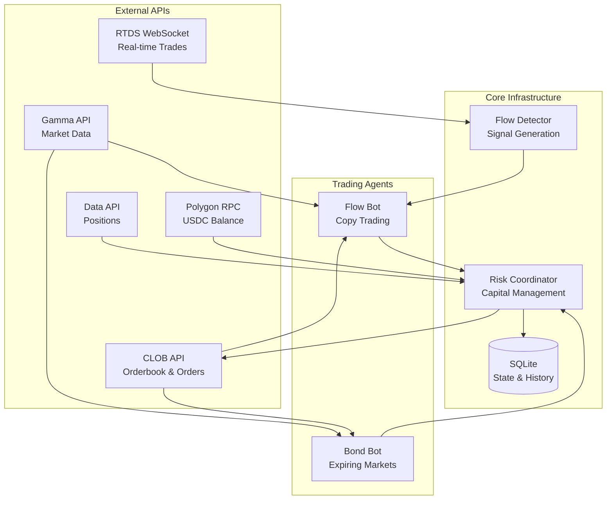
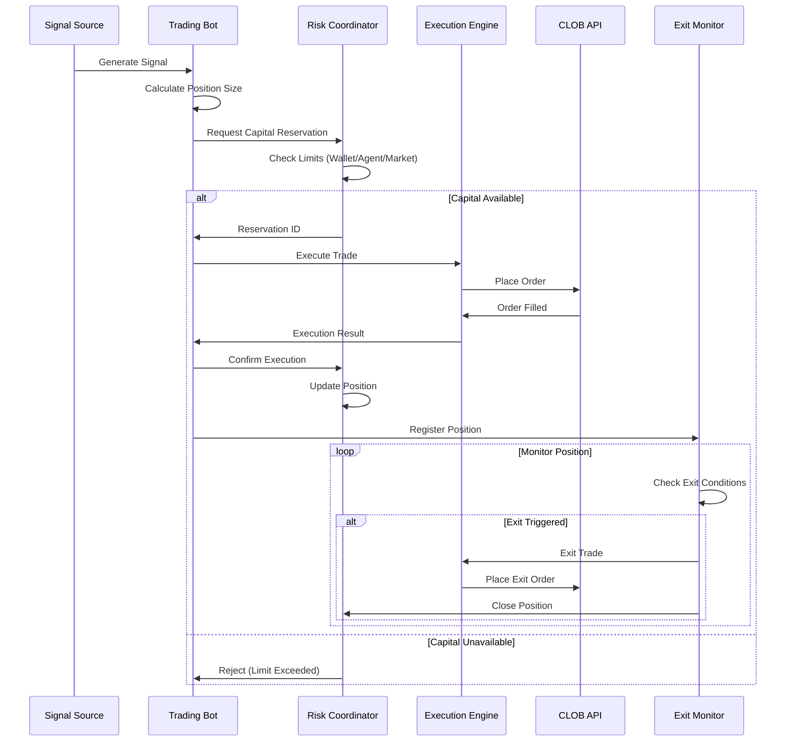
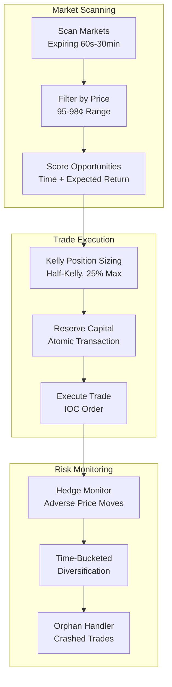
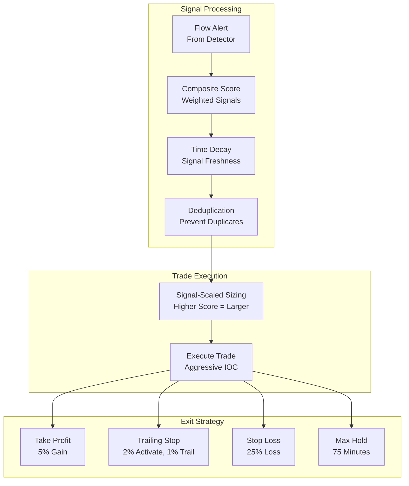
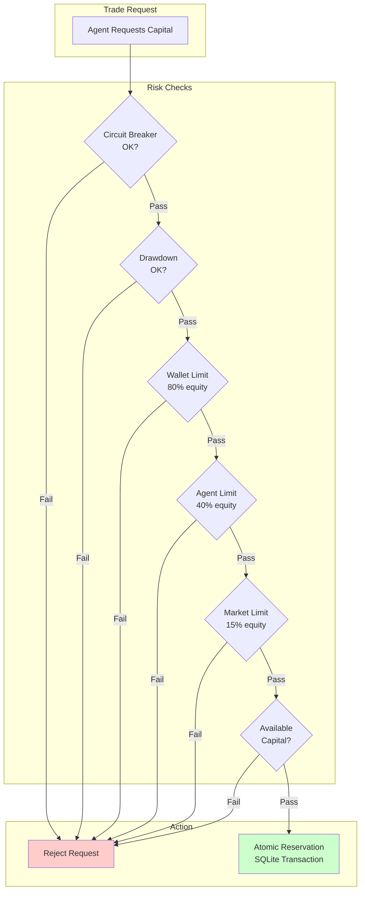
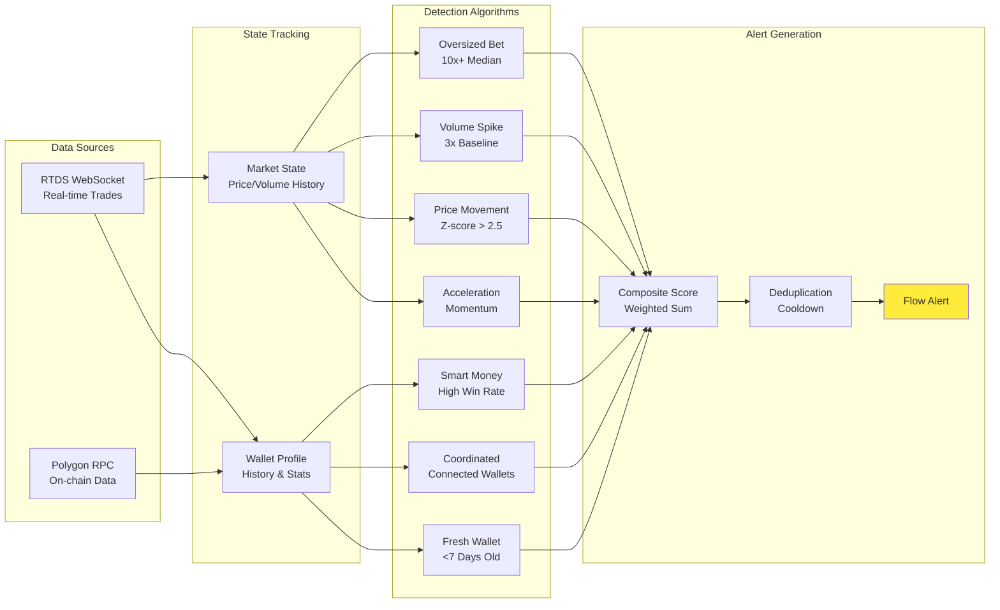
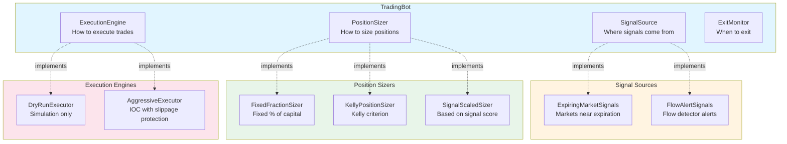

# Polymarket Analytics

A bulletproof multi-agent trading infrastructure for Polymarket, featuring:
- **Multi-agent risk coordination** with atomic capital reservation
- **Composable trading bots** with pluggable components
- **Real-time flow detection** via WebSocket
- **Comprehensive backtesting** with bias warnings

> **Technical Deep-Dive**: See [AGENTS.md](AGENTS.md) for architecture details, API documentation, and how to implement new strategies.

---

## How It Works



**Trading Flow:**
1. **Flow Detector** monitors real-time trades via WebSocket, detecting unusual activity
2. **Trading Agents** (Bond/Flow) generate signals and request capital from Risk Coordinator
3. **Risk Coordinator** atomically reserves capital, enforces limits, and tracks positions
4. **Execution** happens via CLOB API with slippage protection and exit strategies

### Trading Lifecycle



---

## Quick Start

### Prerequisites

- Python 3.10+
- Polymarket account with trading enabled
- Polygon wallet with USDC

### Installation

```bash
# Clone and setup
git clone <repo-url>
cd polymarket-analytics

# Create virtual environment
python3 -m venv venv
source venv/bin/activate

# Install dependencies
pip install -r requirements.txt

# Configure credentials
cp .env.example .env  # Edit with your keys
```

### Running Bots

```bash
# Dry run (no real trades)
python run_bot.py bond --dry-run
python run_bot.py flow --dry-run

# Live trading
python run_bot.py bond --agent-id bond-1 --interval 10
python run_bot.py flow --agent-id flow-1 --interval 5

# Monitor agents
python scripts/risk_monitor.py status
```

---

## Trading Strategies

### Bond Strategy (Expiring Markets)

Trades markets near expiration priced 95-98¢, betting they resolve to $1. Behaves like short-term bonds with high probability of small gain.



```bash
# Dry run
python run_bot.py bond --dry-run --interval 10

# Live trading
python run_bot.py bond --agent-id bond-1 --interval 10

# Custom price range
python run_bot.py bond --min-price 0.94 --max-price 0.99
```

### Flow Copy Strategy

Copies unusual flow signals from smart money, oversized bets, and coordinated wallets.



```bash
# Dry run
python run_bot.py flow --dry-run --interval 5

# With minimum signal score
python run_bot.py flow --min-score 40 --min-trade-size 500

# Filter by category
python run_bot.py flow --category crypto
```

### Running Multiple Agents

Agents coordinate via shared SQLite database - no race conditions.

```bash
# Start multiple agents
python run_bot.py bond --agent-id bond-1 &
python run_bot.py bond --agent-id bond-2 &
python run_bot.py flow --agent-id flow-1 &

# Monitor all agents
python scripts/risk_monitor.py agents

# Emergency stop
python scripts/risk_monitor.py stop-all --yes
```

---

## Risk Management

The `RiskCoordinator` provides bulletproof multi-agent risk management:



| Feature | Description |
|---------|-------------|
| **Atomic Reservation** | No race conditions between agents |
| **State Reconciliation** | Syncs DB with on-chain state on startup |
| **Exposure Limits** | Per-wallet, per-agent, per-market limits |
| **Circuit Breaker** | Stops trading after consecutive failures |
| **Drawdown Limits** | Stops trading on excessive losses |
| **Agent Heartbeats** | Detects crashed agents |

### Monitoring

```bash
python scripts/risk_monitor.py status       # Overall status
python scripts/risk_monitor.py agents       # List agents
python scripts/risk_monitor.py positions    # View positions
python scripts/risk_monitor.py drawdown     # Drawdown status
python scripts/risk_monitor.py cleanup      # Cleanup stale data
```

---

## Flow Detection

Real-time unusual flow detection via Polymarket WebSocket.



| Signal | Description | Weight |
|--------|-------------|--------|
| SMART_MONEY_ACTIVITY | Wallets with >65% win rate | 30 |
| OVERSIZED_BET | Trades 10x+ avg or >$10k | 25 |
| COORDINATED_WALLETS | On-chain connected wallets trading together | 25 |
| VOLUME_SPIKE | Volume 3x+ baseline | 10 |
| PRICE_ACCELERATION | Momentum building | 10 |
| SUDDEN_PRICE_MOVEMENT | Rapid price changes | 8 |
| FRESH_WALLET_ACTIVITY | New wallets (<7 days on-chain) | 5 |

```bash
# Run flow detector standalone
python polymarket/flow_detector.py --verbose --min-trade-size 100
```

---

## Backtesting

```bash
# Bond strategy backtest
python -m polymarket.backtesting.strategies.bond_backtest --backtest --days 60

# Flow strategy backtest
python -m polymarket.backtesting.strategies.flow_backtest --backtest --days 60

# Custom parameters
python -m polymarket.backtesting.strategies.bond_backtest --backtest --entry-price 0.96
python -m polymarket.backtesting.strategies.flow_backtest --backtest --take-profit 0.08

# Parameter optimization
python -m polymarket.backtesting.strategies.bond_backtest --optimize -n 50
python -m polymarket.backtesting.strategies.flow_backtest --optimize -n 50
```

**Bias Warnings** (included in all results):
- **Survivorship Bias**: Only resolved markets analyzed
- **Look-Ahead Bias**: Historical orderbooks not available
- **Execution Optimism**: Assumes fills at quoted prices

---

## Configuration

### Environment Variables

Create a `.env` file:

```bash
# Required for live trading
PRIVATE_KEY=0x...
POLYMARKET_PROXY_ADDRESS=0x...

# Optional
CHAIN_ID=137
POLYGON_RPC_URL=https://polygon-rpc.com
RISK_DB_PATH=data/risk_state.db
LOG_LEVEL=INFO
```

### Risk Limits

```bash
# Exposure limits (as fraction of total equity)
MAX_WALLET_EXPOSURE_PCT=0.80      # 80% max exposure
MAX_PER_AGENT_EXPOSURE_PCT=0.40   # 40% per agent
MAX_PER_MARKET_EXPOSURE_PCT=0.15  # 15% per market

# Trade limits
MIN_TRADE_VALUE_USD=5.0
MAX_TRADE_VALUE_USD=1000.0
MAX_SPREAD_PCT=0.03
MAX_SLIPPAGE_PCT=0.01

# Safety limits
MAX_DAILY_DRAWDOWN_PCT=0.10       # 10% daily stop
MAX_TOTAL_DRAWDOWN_PCT=0.25       # 25% total stop
CIRCUIT_BREAKER_FAILURES=5        # Stop after 5 failures
```

---

## API Reference

| API | Base URL | Purpose | Rate Limit |
|-----|----------|---------|------------|
| **RTDS WebSocket** | `wss://ws-live-data.polymarket.com` | Real-time trades | N/A |
| **Gamma API** | `https://gamma-api.polymarket.com` | Market metadata | 4,000/10s |
| **CLOB API** | `https://clob.polymarket.com` | Orderbook, prices, orders | 9,000/10s |
| **Data API** | `https://data-api.polymarket.com` | Positions, activity | 1,000/10s |
| **Polygon RPC** | Various | USDC balance | Varies |

---

## Component Architecture

The system uses a composition-based architecture where trading bots are assembled from pluggable components:



## Project Structure

```
polymarket-analytics/
├── polymarket/
│   ├── core/                 # Shared infrastructure
│   │   ├── models.py         # Dataclasses (Market, Position, Signal)
│   │   ├── api.py            # Async Polymarket API client
│   │   ├── config.py         # Validated configuration
│   │   └── rate_limiter.py   # Shared rate limiting
│   │
│   ├── trading/              # Live trading infrastructure
│   │   ├── bot.py            # Composition-based TradingBot
│   │   ├── risk_coordinator.py
│   │   ├── safety.py         # Circuit breakers, drawdown limits
│   │   ├── storage/          # SQLite persistence
│   │   └── components/       # Pluggable components
│   │       ├── signals.py    # Signal sources
│   │       ├── sizers.py     # Position sizers
│   │       ├── executors.py  # Execution engines
│   │       └── exit_strategies.py
│   │
│   ├── strategies/           # Strategy implementations
│   │   ├── bond_strategy.py  # Expiring market strategy
│   │   └── flow_strategy.py  # Flow copy strategy
│   │
│   ├── backtesting/          # Backtesting framework
│   │   ├── optimization.py   # Anti-overfitting optimizer
│   │   └── strategies/       # Bond/flow backtesters
│   └── flow_detector.py      # Real-time flow detection
│
├── webapp/                   # Dashboard (FastAPI)
├── scripts/                  # CLI utilities
│   └── run_bot.py           # Bot entry point
└── requirements.txt
```

---

## Extending the System

The system uses composition-based architecture, making it easy to add custom components.

### Adding a Custom Signal Source

```python
from polymarket.trading.components.signals import SignalSource
from polymarket.core.models import Signal, SignalDirection

class MySignalSource(SignalSource):
    """Custom signal source implementation."""

    @property
    def name(self) -> str:
        return "my_signal"

    async def get_signals(self) -> List[Signal]:
        # Your signal generation logic
        signals = []
        for market in self._markets:
            if self._should_trade(market):
                signals.append(Signal(
                    market_id=market.condition_id,
                    token_id=market.tokens[0].token_id,
                    direction=SignalDirection.BUY,
                    strength=0.8,  # 0-1 confidence
                    source=self.name,
                ))
        return signals
```

### Adding a Custom Position Sizer

```python
from polymarket.trading.components.sizers import PositionSizer
from polymarket.core.models import Signal

class MyPositionSizer(PositionSizer):
    """Custom position sizing strategy."""

    @property
    def name(self) -> str:
        return "my_sizer"

    def calculate_size(
        self,
        signal: Signal,
        available_capital: float,
        current_price: float
    ) -> float:
        # Scale by signal strength
        base_size = available_capital * 0.10  # 10% base
        return base_size * signal.strength
```

### Adding a New Strategy

1. Create strategy file in `polymarket/strategies/`
2. Implement `generate_signals()` and `run_strategy_loop()` methods
3. Register in `scripts/run_bot.py`

---

## Testing Guide

### Running Tests

```bash
# All tests
pytest tests/

# Specific test file
pytest tests/test_risk_engine_integration.py -v

# Pattern matching
pytest -k "test_reservation" -v

# With coverage
pytest --cov=polymarket tests/
```

### Test Structure

| File | Purpose |
|------|---------|
| `test_risk_engine_integration.py` | RiskCoordinator integration tests |
| `test_chain_reconciliation.py` | On-chain sync reconciliation |
| `test_reconciliation.py` | State reconciliation tests |

### Writing New Tests

```python
import pytest
from polymarket.trading.risk_coordinator import RiskCoordinator

@pytest.mark.asyncio
async def test_capital_reservation():
    """Test atomic capital reservation."""
    coordinator = RiskCoordinator(...)

    reservation = await coordinator.reserve_capital(
        agent_id="test-agent",
        market_id="test-market",
        amount_usd=100.0,
    )

    assert reservation is not None
    assert reservation.amount_usd == 100.0
```

---

## Database Schema

The system uses SQLite with WAL mode for concurrent access. Key tables:

### Core Tables

**agents** - Trading agent registration
| Column | Type | Description |
|--------|------|-------------|
| agent_id | TEXT PK | Unique agent identifier |
| agent_type | TEXT | 'bond' or 'flow' |
| wallet_address | TEXT | Associated wallet |
| started_at | TEXT | ISO timestamp |
| last_heartbeat | TEXT | Last activity |
| status | TEXT | ACTIVE/STOPPED/CRASHED |

**positions** - Active trading positions
| Column | Type | Description |
|--------|------|-------------|
| id | INTEGER PK | Auto-increment ID |
| agent_id | TEXT | Owning agent |
| market_id | TEXT | Market identifier |
| token_id | TEXT | Token identifier |
| outcome | TEXT | YES/NO outcome |
| shares | REAL | Number of shares |
| entry_price | REAL | Entry price |
| status | TEXT | OPEN/CLOSED/EXPIRED |

**reservations** - Capital reservations
| Column | Type | Description |
|--------|------|-------------|
| id | TEXT PK | UUID |
| agent_id | TEXT | Requesting agent |
| market_id | TEXT | Target market |
| amount_usd | REAL | Reserved amount |
| status | TEXT | PENDING/EXECUTED/RELEASED |
| created_at | TEXT | Creation timestamp |
| expires_at | TEXT | Expiration time |

**transactions** - On-chain transaction log
| Column | Type | Description |
|--------|------|-------------|
| id | INTEGER PK | Auto-increment ID |
| tx_hash | TEXT | Transaction hash |
| block_number | INTEGER | Block number |
| block_timestamp | TEXT | Block timestamp |
| event_type | TEXT | BUY/SELL/REDEEM |
| token_id | TEXT | Token identifier |
| amount | REAL | Trade amount |
| price | REAL | Execution price |

### Inspection

```bash
# View database
sqlite3 data/risk_state.db

# List tables
.tables

# Schema for a table
.schema positions

# Active positions
SELECT * FROM positions WHERE status = 'OPEN';
```

---

## Performance Considerations

### API Rate Limits

| API | Rate Limit | Purpose |
|-----|------------|---------|
| CLOB API | 9,000/10s | Orderbook, orders |
| Gamma API | 4,000/10s | Market metadata |
| Data API | 1,000/10s | Positions, activity |

### Async Best Practices

```python
# Good: Parallel fetches
results = await asyncio.gather(
    api.fetch_markets(),
    api.fetch_positions(),
    api.fetch_balance(),
)

# Bad: Sequential fetches
markets = await api.fetch_markets()
positions = await api.fetch_positions()
balance = await api.fetch_balance()
```

### Database Optimization

- WAL mode enabled for concurrent reads
- Indexes on `agent_id`, `market_id`, `token_id`
- 30-day retention for request_log table
- Use `LIMIT` for large queries

---

## Troubleshooting

### Bots not starting
- Check `.env` file has required credentials
- Verify `PRIVATE_KEY` and `POLYMARKET_PROXY_ADDRESS` are set

### Rate limit errors
- Reduce polling interval: `--interval 30`
- Check `API_RATE_LIMIT_PER_10S` setting (default: 9000 for CLOB API)

### No signals detected
- Flow detector needs time to build market state
- Try lowering `--min-score` or `--min-trade-size`

### Circuit breaker triggered
```bash
python scripts/risk_monitor.py status   # Check status
python scripts/risk_monitor.py cleanup  # Reset
```

---

## Roadmap & TODOs

### Planned Features

- [ ] **Additional Strategies**: Mean reversion, news-based trading, arbitrage detection
- [ ] **Dashboard Improvements**: Real-time P&L charts, position visualization
- [ ] **Alert Integrations**: Telegram/Discord notifications for signals and fills
- [ ] **Multi-Wallet Support**: Coordinate trading across multiple wallets
- [ ] **Enhanced Backtesting**: Realistic slippage modeling, market impact simulation
- [ ] **Strategy Optimizer**: Bayesian parameter optimization for new strategies

### Known Issues / Technical Debt

- [ ] API rate limiting edge cases under sustained high load
- [ ] Orphan position cleanup could be more aggressive on market resolution
- [ ] WebSocket reconnection occasionally drops first few trades after reconnect
- [ ] CLOB API timeout handling could be more graceful
- [ ] Exit monitor position registration has 30s grace period (API sync delay)

---

## License

MIT License
